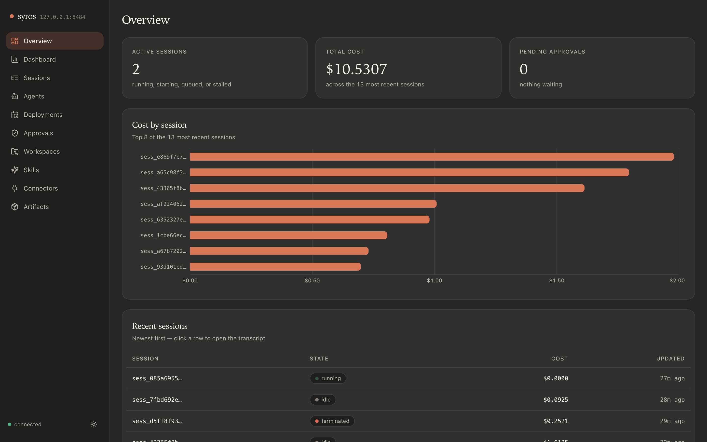
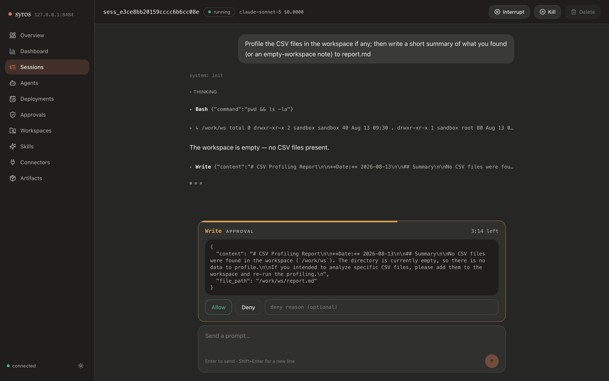
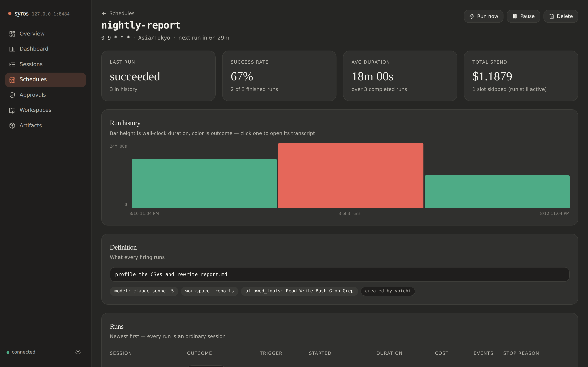

# syros

Run [`claude_agent_sdk`](https://code.claude.com/docs/en/agent-sdk) agents in sandboxed
Cloud Run Jobs inside your own GCP project. Same API shape as the SDK; models go through
Vertex AI by default, every tool call is written to an audit trail before it executes,
and calls can be gated on human approval.

The idea is to add as little as possible on top of what already exists.
`claude_agent_sdk` already provides the harness (loop, tools, permissions, sessions,
resume), and GCP managed services cover the control plane: Firestore holds session state,
the event stream, the audit trail, and the approval queue; Cloud Run Jobs are the sandbox;
GCS is the workspace; IAM is auth. syros is one Python package and one Terraform module —
no servers, no REST API, and roughly zero always-on cost.

## Use

```python
from syros import query, AgentOptions, PermissionResultAllow

async def approve(tool_name, tool_input, context):
    print(f"allow {tool_name}({tool_input})?")
    return PermissionResultAllow()

async for message in query(
    prompt="profile the CSVs in the workspace and write a report",
    options=AgentOptions(
        model="claude-sonnet-5",
        system_prompt="You are a careful data analyst.",
        allowed_tools=["Read", "Write", "Bash", "Glob", "Grep"],
        permission_mode="default",   # unlisted tools pause for approval
        can_use_tool=approve,        # drives the approval queue from your machine
    ),
):
    print(message)
```

The harness runs in the project's Cloud Run Job (project from `AgentOptions.project` or
`$SYROS_PROJECT` / `$GOOGLE_CLOUD_PROJECT`); the message types stream back through
Firestore. Sessions are durable: `AgentOptions(resume="sess_...")` reconnects, idle
sessions scale to zero.

Multi-turn, mirroring `ClaudeSDKClient`:

```python
from syros import SyrosClient, AgentOptions

async with SyrosClient(AgentOptions()) as client:
    await client.query("read the data")
    async for message in client.receive_response():
        ...
    await client.query("now summarize it")     # same durable session
    async for message in client.receive_response():
        ...
    # client.interrupt() / client.terminate() / AgentOptions(resume=client.session_id)
```

Ops without a UI:

```
syros sessions                       # recent sessions: status, cost, stop reason
syros tail sess_...                  # follow a session's message feed
syros approvals sess_...             # pending approvals
syros approvals sess_... allow <call_hash>
syros kill sess_...                  # kill switch: denies every further tool call
```

Sharing results with other users goes through artifact spaces — named prefixes
(`artifacts/{space}/`) in the session bucket that any user with read access on the bucket
can pull. Nothing new to run or deploy; sharing is the existing IAM story (grant
`roles/storage.objectViewer` on the bucket):

```
syros artifacts                              # list spaces
syros artifacts team                         # list files in a space
syros artifacts team push report.md out/     # upload files or directories
syros artifacts team pull ./downloads        # download a space
syros artifacts team publish sess_... report.md
                                             # copy straight out of a session's
                                             # checkpointed workspace (server-side)
```

Agents join the same spaces via `AgentOptions(artifacts=...)`: each space is mounted at
`./artifacts/{space}/` in the working directory, so the agent reads, edits, and writes it
with its ordinary file tools — every write is still an audited, gateable tool call. Pass a
name for one read-write space, or a dict of modes; `"ro"` restores without checkpointing
back, for sessions that consume shared inputs but must not publish:

```python
AgentOptions(artifacts="team")                      # read-write
AgentOptions(artifacts={"team": "rw", "ref": "ro"})
```

Or with one — the console is a pure Firestore client (no server-side state):

```
syros console                        # web console at localhost:8484
```



Sessions — starting new ones from a prompt-plus-options form as well as watching
existing ones — live transcripts, approve/deny with countdown, prompts into idle sessions
(re-triggers the runner job), interrupt, kill, and delete — one session or a checkbox
selection at a time (running and starting sessions have to be killed first). The state
column is liveness rather than raw status: `starting` is a triggered job that hasn't
claimed the session yet, `running` holds a live lease, and either one whose window lapsed
shows as `stalled` — a job that died or never came up, and deletable as such. Shared
workspaces are editable: open one to edit a file in place, upload, or delete — writes are
refused while a run holds the lease, since its checkpoint would overwrite them. It also
deploys to Cloud Run (`syros-console`, public URL behind IAP, IAM-gated), so the same console is
reachable without a local checkout or GCP client libraries; see [Deploy](#deploy).



The frontend lives in `console/` (Next.js static export + TypeScript + Tailwind); `make console`
rebuilds the bundle into `src/syros/console/static/` (gitignored) for local use; the
Docker image builds its own copy in a Node stage, so deploys need no local build.

## Agents

An agent is a named, stored run configuration — the persona a session runs as: system
prompt, model, allowed tools, permission mode, workspace, artifact spaces, budgets. One
Firestore document, mirroring Claude Managed Agents' Agent object (minus versioning:
the document is mutable, and every session snapshots the options it resolved at creation,
so editing an agent changes future runs only).

Reference it from the SDK with `AgentOptions(agent=...)`: the stored options become the
defaults, and any field set explicitly alongside it overrides them per field:

```python
from syros import query, AgentOptions

async for message in query(
    prompt="review the diff in the workspace",
    options=AgentOptions(agent="reviewer", model="claude-opus-5"),  # model overrides
):
    ...
```

```
syros agents create reviewer   --system-prompt "You are a careful code reviewer."   --allow Read --allow Grep --model claude-sonnet-5

syros agents                     # list agents
syros agents show|update|delete reviewer
```

The console has an Agents view with the same create/edit/delete surface, and sessions
show which agent they ran as. Deployments can reference an agent too (below).

## Deployments

A deployment is a cron expression plus a prompt plus the usual run options, stored as one
Firestore document. Each firing starts a *fresh ordinary session* — same list, transcript,
approval queue, audit trail, kill switch — tagged with the deployment's name, so scheduled
work is governed exactly like interactive work. Nothing in the runner knows deployments
exist.

```
syros deployments create nightly-report \
  --cron "0 9 * * *" --tz Asia/Tokyo \
  --prompt "profile the CSVs and rewrite report.md" \
  --model claude-sonnet-5 --workspace reports --allow Read --allow Write

syros deployments                      # each deployment, its next slot, last run
syros deployments runs nightly-report  # run history: outcome, trigger, cost
syros deployments run nightly-report   # fire once, off-cycle (clock untouched)
syros deployments pause|resume|delete nightly-report
```

A deployment can name an agent (`--agent reviewer`) whose stored options become the run
defaults — resolved fresh at each firing, so an agent edit reaches the next run without
touching the deployment; the deployment's own options still override per field.

The console has the same surface with a run-status view per deployment: outcome/duration
bars over the run history (click a bar for that run's transcript), success rate, average
duration, spend, and a create/pause/run-now/delete UI. Cron is the standard 5-field
syntax (`@daily` etc. work), evaluated as wall-clock time in the deployment's IANA
timezone, so a 9am deployment stays at 9am across DST.



What advances the clock is `syros tick`, which fires every due deployment and exits;
Terraform wires Cloud Scheduler → a `syros-scheduler` Cloud Run Job to run it every
minute (`tick_schedule` to change — its cadence is the effective granularity of all
deployments). The tick is transactional and idempotent: overlapping ticks can't
double-fire, an outage catches up with one run rather than replaying missed slots, and
a slot that comes due while the previous run is still active is skipped and counted
(one live run per deployment — also what a shared workspace's lease would force anyway).
Failures are visible, not silent: a deployment whose launch fails records `last_error`,
and one whose cron can no longer fire is auto-paused with the reason on it.

## Connectors

A connector mounts a platform's *official, vendor-hosted* remote MCP server into a
session — syros ships no integration code of its own, just the catalog entry and one
credential in Secret Manager (`syros-connector-{name}`; Terraform creates the empty
containers). The sandbox runner reads the credential at run start and expands each name
into ordinary `mcp_servers` entries with an `Authorization` header, so every connector
tool call flows through the same audit trail and approval gate as any other tool.
Only names are serialized — tokens never pass through Firestore.

| name | platform | servers | credential |
|---|---|---|---|
| `slack` | Slack | `mcp.slack.com` | OAuth (`auth`) |
| `notion` | Notion | `mcp.notion.com` | OAuth (`auth`), or an integration token (`set`) |
| `github` | GitHub | `api.githubcopilot.com/mcp` | a PAT (`set`) |
| `google` | Google Workspace | Drive, Gmail, Calendar, Docs, Sheets (`*mcp.googleapis.com`) | OAuth (`auth --client-secrets`) |

```
syros connectors                     # catalog + credential status
syros connectors auth slack          # browser OAuth (MCP-spec, dynamic client registration)
syros connectors auth google --client-secrets oauth_client.json
syros connectors set github          # paste a static token (prompted, or --token/--file)
syros connectors remove notion       # destroy the stored credential
```

```python
AgentOptions(connectors=["slack", "github"])   # tools arrive as mcp__slack__*, mcp__github__*
```

Agents and deployments take the same list (an override replaces the persona's list, like
`allowed_tools`); the console shows the catalog under Connectors and offers the picker in
both forms. Notes: tokens are minted once per run, so a run longer than the token's
lifetime (~1h for Google) loses that connector's tools until the next run; a missing or
unrefreshable credential fails the run fast with `stop_reason=connector_error`; Slack may
require a workspace admin to approve the app the OAuth flow registers. Rolling out: deploy
the new image before creating connector-bearing sessions — older runner images reject the
new option field.

## Skills

Sessions can carry [Agent Skills](https://code.claude.com/docs/en/skills) — a skill is a
directory (`SKILL.md` plus resources) under `skills/{name}/` in the same bucket the
sessions use. The runner restores the whole prefix into the sandbox HOME's
`.claude/skills/` at run start, so `claude_agent_sdk` discovers every skill in every
session — no per-session opt-in, and nothing new to deploy. The prefix is the single
source of truth: checkpoints never write skills back, so a skill deleted from the console
stays deleted.

```
syros skills                         # list skills in the bucket
syros skills files pdf               # list one skill's files
syros skills cat pdf SKILL.md        # print one skill file
syros skills sync                    # seed skills/ from the official anthropics/skills repo
```

`sync` pulls the official [anthropics/skills](https://github.com/anthropics/skills)
tarball and copies each skill into the bucket — nothing is vendored, and the copies are
editable snapshots: re-syncing overwrites official files but never touches skills (or
files) the tarball doesn't carry. The console has a Skills view with the same surface as
workspaces — browse a skill, edit a file in place, upload, or delete the skill.

## Analysis

Firestore holds all the state but is a poor analysis surface. `syros export` snapshots the
control plane into five flat BigQuery tables — `sessions`, `events`, `tool_calls`,
`approvals`, `agents` — in the Terraform-created `syros` dataset (`--dataset` / `$SYROS_DATASET` to
override):

```
syros export                         # idempotent: each run replaces the tables
```

```sql
-- what did each session cost, and how did it end?
SELECT session_id, model, cost_usd, status, stop_reason
FROM syros.sessions ORDER BY cost_usd DESC;

-- which tools run most, and does anything get denied?
SELECT tool_name, decision, COUNT(*) AS calls
FROM syros.tool_calls GROUP BY 1, 2 ORDER BY calls DESC;

-- how long do humans take to decide approvals?
SELECT tool_name, status, decided_by,
       TIMESTAMP_DIFF(decided_at, requested_at, SECOND) AS latency_s
FROM syros.approvals ORDER BY requested_at DESC;

-- what does each stored agent cost per run?
SELECT s.agent, COUNT(*) AS runs, AVG(s.cost_usd) AS avg_cost_usd
FROM syros.sessions s JOIN syros.agents a ON s.agent = a.name
GROUP BY 1 ORDER BY runs DESC;

-- dig into any message; full payloads live in JSON columns
SELECT session_id, seq, JSON_VALUE(message.total_cost_usd) AS cost
FROM syros.events WHERE kind = 'result';
```

Like the rest of the ops surface it runs with the caller's identity. Exporting needs
`roles/bigquery.jobUser` plus write access on the dataset; for a standing feed, point
Cloud Scheduler at anything that can run `syros export`.

The same tables are queryable *from inside a session*. `mcp_servers` takes a reference to
a built-in in-process server — options travel through Firestore, so the session names the
builtin and the runner swaps in the live server — and the agent gets an ordinary MCP tool
named after your key, audited and gateable like any other:

```python
AgentOptions(
    mcp_servers={"bq": {"type": "builtin", "name": "bigquery"}},
    allowed_tools=["mcp__bq__query"],   # otherwise every query waits for approval
)
```

which is what makes an unattended audit a schedule rather than a person:

```
syros deployments create nightly-audit --cron "0 9 * * *" --tz Asia/Tokyo \
  --prompt "Query the syros BigQuery tables: yesterday's spend by model, any
            denied or killed tool calls, approvals that timed out. Write
            findings.md to the audit artifact space." \
  --model claude-sonnet-5 --artifacts audit
```

Two things to know. The sandbox reads BigQuery only where the deployment allows it —
`terraform apply -var sandbox_bigquery=true` (see [Security model](#security-model)); off
by default, the tool exists but every query comes back as a permission error. And the
tables are a snapshot: as fresh as the last `syros export`, which runs with the caller's
identity — so schedule the export ahead of the audit, or the agent audits yesterday's
yesterday. The tool's description says so, and the tables carry `updated_at`.

The tool is read-only, dry-run-costed, and capped: only `SELECT` (anything BigQuery's dry
run parses as a script or a write is refused before it runs), refused above
`bq_max_bytes` scanned, `maximum_bytes_billed` set on the job, and at most `bq_max_rows`
rows back. One side effect worth knowing: the audit session's own queries land in the
*next* export's `tool_calls` — the audit audits itself.

## Security model

- **Data boundary** — model calls exit only via Vertex AI by default (the sandbox has no
  Anthropic API key); state lives in your project's Firestore/GCS. Note: Claude on Vertex
  currently serves on the `global` endpoint, and a fresh project's quota starts at zero —
  request it before relying on this. `model_backend = "anthropic"` is the escape hatch
  while that quota is pending: it mounts the `anthropic-api-key` secret and calls the
  Anthropic API directly, which moves model traffic outside GCP. Opt in deliberately.
- **Credential-less sandbox** — by default the runner's service account has exactly:
  `aiplatform.user`, `datastore.user`, object access on the one session bucket, and read
  access on the per-connector secrets (empty until you store a credential; the
  `anthropic-api-key` secret is readable only under `model_backend = "anthropic"`). No
  secrets are mounted as env vars; connector credentials are read per run, injected as
  MCP headers in memory, and never written anywhere. For any other tool credential, keep
  it host-side: the approval/custom-tool round-trip runs on the caller's machine with
  the caller's identity.
- **The BigQuery widening, and it is a real one** — `sandbox_bigquery = true` adds
  project-level `roles/bigquery.jobUser` + `roles/bigquery.dataViewer` to the runner:
  read access to **every dataset in the project**, for **every** session — including
  sessions whose prompt came from a schedule or from anyone who can open the console.
  Turn it on only where the project's BigQuery data sits inside the same trust boundary
  as the agents; for a narrower deployment, swap the project-level grant for dataset-level
  `dataViewer` on the `syros` dataset alone (the comment in `infra/main.tf` shows how).
  What the code adds on top: IAM makes writes impossible, the tool refuses anything
  BigQuery doesn't parse as a `SELECT`, `maximum_bytes_billed` caps one query, and every
  query is written to the audit trail with its SQL before it executes. Per-query caps
  bound a query, not a day — use a BigQuery custom quota for a hard ceiling — and query
  results land in the transcript and in whatever the agent writes to an artifact space.
- **Audit before execution** — a `PreToolUse` hook writes the tool-call row to
  `sessions/{sid}/tool_calls` and awaits the commit *before* the tool runs, so the gate
  is enforced in code rather than by prompting.
- **Approvals** — `permission_mode`-gated calls file a document in
  `sessions/{sid}/approvals` and block until your `can_use_tool` callback (or
  `syros approvals`) decides; timeout denies (default 300s).
- **Kill switch** — `syros kill` flips `disabled`; checked on every tool call and at claim.
- **IAM is the tenancy model** — one GCP project = one trust boundary.

## Deploy

```sh
# 1. Infrastructure (Firestore, bucket, Artifact Registry, job, service accounts)
cd infra
terraform init
terraform apply -var project=YOUR_PROJECT \
  -var image=asia-northeast1-docker.pkg.dev/YOUR_PROJECT/syros/runner:latest

# 2. Runner image — one image serves both the job and the console
gcloud builds submit --tag asia-northeast1-docker.pkg.dev/YOUR_PROJECT/syros/runner:latest .

# 3. Smoke test
export SYROS_PROJECT=YOUR_PROJECT
uv run python examples/hello.py
```

Cloud Run resolves an image tag at deploy time, so a fresh project applies twice: the first
`terraform apply` creates Artifact Registry (and fails on the job/service until an image
exists), then step 2 pushes, then re-apply. Afterwards `make deploy` rebuilds, pushes, and
re-pins both the job and the console service to the new digest — pushing `:latest` alone
leaves them on the old one. `make deploy-console` does the frontend-only path (rebuild the
Next.js bundle, ship the service).

Callers need `datastore.user`, `run.jobs.runWithOverrides` (e.g. `roles/run.developer`, or
`roles/run.jobsExecutorWithOverrides` on the runner job — the job is always triggered with
a container override carrying the session id, so plain `run.invoker` is not enough), and read access
on the session bucket. Optional egress lockdown: pass `-var vpc_connector=...` to route the
job through your VPC. `-var sandbox_bigquery=true` lets sessions use the built-in BigQuery
tool (see [Security model](#security-model) before flipping it).

### The console on Cloud Run

`syros-console` runs the same image with a different entrypoint (`syros console --host
0.0.0.0`, binding `$PORT`), scales 0→1, and holds a service account with `datastore.user`,
`storage.objectUser` on the session bucket, and `run.jobsExecutorWithOverrides` on the runner job — enough to
serve every page, edit workspace files, and re-trigger a job when you prompt an idle
session. It keeps no server-side state, so restarts and scale-to-zero cost nothing.

No `allUsers` binding exists. By default (`console_iap = true`) the service sits behind
[Identity-Aware Proxy](https://cloud.google.com/iap/docs/enabling-cloud-run): the service
URL (the `console_url` terraform output) is reachable from any browser, IAP handles the
Google sign-in, and only principals listed in `console_invokers` get through — public
endpoint, IAM-gated access.

```sh
# grant access at apply time
terraform apply -var 'console_invokers=["user:me@example.com"]' ...

open $(terraform output -raw console_url)   # sign in with Google; IAP checks IAM
```

With `-var console_iap=false` there is no unauthenticated surface at all; reach it as
yourself over an authenticated proxy instead:

```sh
gcloud run services proxy syros-console --region asia-northeast1  # → localhost:8080
```

Anyone who can open the console can approve tool calls, delete sessions, and edit workspace
files, so scope `console_invokers` the way you'd scope the project itself. The `getpass` user inside the
container is the same for everyone, so approvals made through the deployed console are
attributed to the container's user, not the human — Cloud Run's access logs are the record
of who acted.

## How a run works

1. `query()` writes `sessions/{sid}` + the prompt to the inbox, then triggers the Cloud Run
   Job (skipped if an execution already holds the session lease) and marks the session
   `starting`.
2. The runner claims the lease, restores the workspace and `claude_agent_sdk` transcript
   from GCS, and runs the harness on Vertex with the gate hooks wired in.
3. Every message is mirrored to `sessions/{sid}/events`; the client polls and yields them
   as typed messages, ending at the `ResultMessage`.
4. On idle the runner waits `SYROS_STAY_ALIVE` (60s) for follow-ups, checkpoints state to
   GCS, and exits 0 — scale to zero. **The client is the reconciler**: a later
   `resume=` query simply re-triggers the job.

## Divergences from claude_agent_sdk

`AgentOptions` only defines options the sandbox can honour — passing a machine-local
`ClaudeAgentOptions` field raises `TypeError` at the constructor instead of silently
doing nothing.

| claude_agent_sdk option | syros |
|---|---|
| `system_prompt` (str), `model`, `tools`, `allowed_tools`, `disallowed_tools`, `permission_mode`, `max_turns`, `max_budget_usd` | supported, identical semantics (passed through to the harness) |
| `can_use_tool` | supported; it rides the Firestore approval queue (audited, timeout-denied) |
| `mcp_servers` | http/sse configs, plus syros's own in-process servers by reference: `{"type": "builtin", "name": "bigquery"}`, resolved in the sandbox. The dict key names the tool (`{"bq": ...}` → `mcp__bq__query`) and must be a short lowercase name. Caller-defined in-process servers and stdio still can't cross the wire (`OptionsError`) |
| `resume` | syros session id (`sess_...`) |
| `cwd` | managed (GCS-backed); no local paths |
| `workspace` | syros-only: a short name (`[a-z0-9][a-z0-9_-]*`), not a path. Sessions naming the same workspace share one GCS-backed working directory (`workspaces/{name}/`); transcripts stay per-session, so `resume` is unaffected. One live run per workspace — a contending run ends immediately with `stop_reason="workspace_busy"` and the prompt stays queued for a retry. Checkpoints never delete GCS objects, so a file deleted in one run reappears on the next restore — delete it in the console to remove it for good |
| `artifacts` | syros-only: shared artifact spaces mounted at `./artifacts/{space}/` in the working directory. A str is one read-write space; a dict maps names to `"rw"` (restored, checkpointed back on idle) or `"ro"` (restored only). No lease — checkpoints are per-file last-writer-wins, so spaces are for publishing outputs and reading shared inputs, not concurrent editing of one file |
| `system_prompt` presets, `hooks`, `env`, `add_dirs`, `setting_sources`, `session_id`, `fork_session`, ... | not defined — `TypeError`. Governance hooks are owned by the platform; the sandbox owns its environment |

## Out of scope

REST API (the SDK is the surface; `syros console` is a pure Firestore client, not a
control plane — deleting it loses nothing), versioned agent registry (options travel with the session; pin by
committing code), vaults/egress proxy (the sandbox holds no secrets; keep them
host-side), multi-env tenancy (one project per trust boundary).

## Development

```sh
uv sync --group dev
uv run pytest -q
uvx ruff check src tests && uvx ruff format --check src tests
```

Layout: `src/syros/` (client SDK + sandbox runner in one package), `infra/` (Terraform),
`examples/`, `tests/` (unit + fake-store integration; no GCP needed).

## Status

Early and evolving — interfaces may still change between releases. Issues and pull
requests are welcome.
